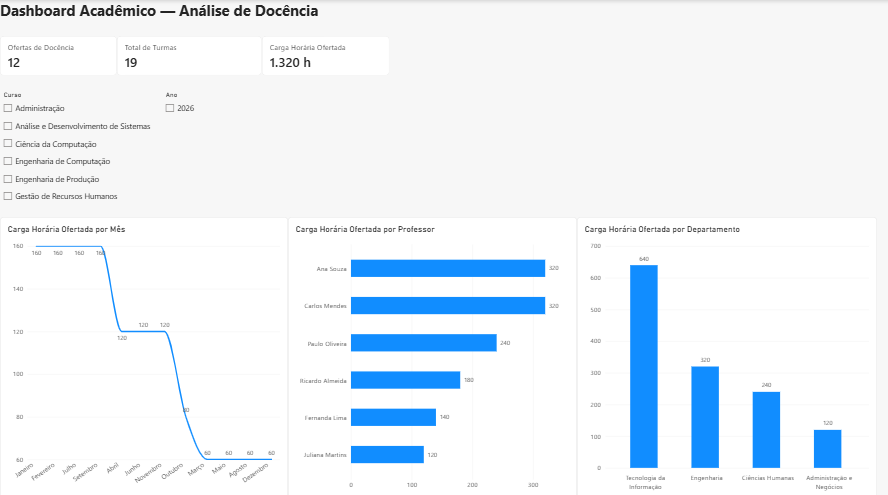
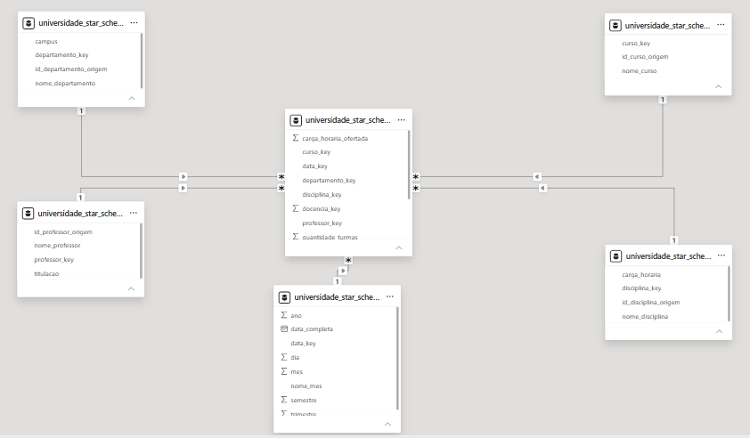
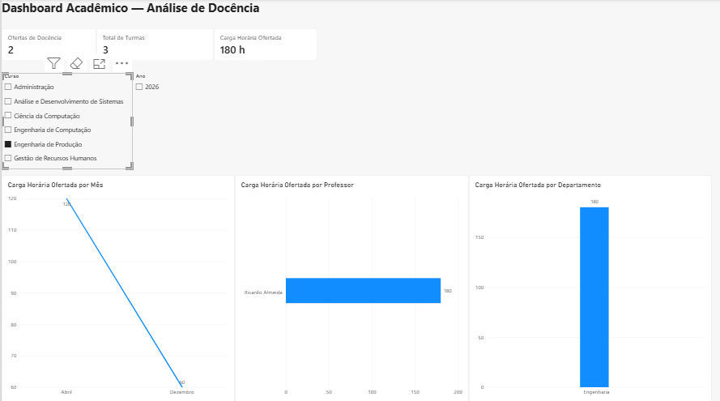

# Desafio Power BI — Star Schema para Cenários Acadêmicos
Projeto de modelagem dimensional Star Schema aplicado a um cenário acadêmico, com MySQL no Azure, Power BI, DAX e dashboard para análise de docência.

## 📌 Sobre o Projeto

Este projeto foi desenvolvido como parte do desafio prático da DIO, com o objetivo de aplicar conceitos de modelagem dimensional por meio da construção de um modelo Star Schema.

O cenário foi estruturado para análise de docência, tendo o professor como um dos principais objetos de análise e relacionando informações de cursos, disciplinas, departamentos e períodos acadêmicos.

Além da modelagem dimensional proposta no desafio, o projeto foi ampliado com a implementação do banco de dados MySQL no Microsoft Azure, integração com o Power BI, criação de medidas DAX e desenvolvimento de um dashboard interativo para análise dos dados.

## 🎯 Objetivo do Desafio

Construir um modelo dimensional no formato Star Schema a partir de um cenário acadêmico, organizando os dados em uma tabela fato central e tabelas dimensão relacionadas.

O modelo foi estruturado para permitir análises sobre:

- Professores
- Departamentos
- Cursos
- Disciplinas
- Períodos acadêmicos
- Quantidade de turmas
- Carga horária ofertada

- ## ⭐ Arquitetura Star Schema

O modelo dimensional foi organizado com a tabela `fato_docencia` no centro do esquema, conectada às tabelas dimensão por meio de suas respectivas chaves.

### Tabela Fato

- `fato_docencia` — concentra os registros de docência e as métricas quantitativas utilizadas nas análises.

### Tabelas Dimensão

- `dim_professor` — informações dos professores.
- `dim_departamento` — informações dos departamentos acadêmicos.
- `dim_curso` — informações dos cursos.
- `dim_disciplina` — informações das disciplinas e suas cargas horárias.
- `dim_data` — dimensão temporal utilizada para análises por período.

- ## 🛠️ Tecnologias Utilizadas

- **Microsoft Azure** — hospedagem do banco de dados MySQL na nuvem.
- **MySQL** — criação e estruturação do banco de dados dimensional.
- **MySQL Workbench** — desenvolvimento e validação das tabelas e consultas SQL.
- **Power BI Desktop** — conexão, modelagem, criação das medidas DAX e desenvolvimento do dashboard.
- **DAX (Data Analysis Expressions)** — criação dos indicadores e métricas utilizadas nas análises.
- **GitHub** — versionamento e documentação do projeto.

- ## 📊 Medidas DAX

Foram criadas medidas para representar os principais indicadores do dashboard.

### Ofertas de Docência

```DAX
Ofertas de Docência =
COUNTROWS('universidade_star_schema fato_docencia')
```
```DAX
Total de Turmas =
SUM('universidade_star_schema fato_docencia'[quantidade_turmas])
```

```DAX
Carga Horária Total =
SUM('universidade_star_schema fato_docencia'[carga_horaria_ofertada])
```

```DAX
Carga Horária Ofertada =
FORMAT([Carga Horária Total], "#,##0") & " h"
```

## 📈 Dashboard Acadêmico — Análise de Docência

O dashboard foi desenvolvido para transformar o modelo dimensional em uma visão analítica e interativa dos dados acadêmicos.

### Principais Indicadores

- **Ofertas de Docência:** 12
- **Total de Turmas:** 19
- **Carga Horária Ofertada:** 1.320 h

### Análises Disponíveis

- Carga Horária Ofertada por Mês
- Carga Horária Ofertada por Professor
- Carga Horária Ofertada por Departamento

### Filtros Interativos

- **Curso**
- **Ano**

Os filtros permitem alterar o contexto das análises e atualizar dinamicamente os indicadores e gráficos do relatório.

## 🚀 Além do Desafio Proposto

Além da construção do modelo dimensional solicitada no desafio, o projeto foi expandido para representar um cenário mais próximo de uma solução de dados completa.

Foram adicionadas as seguintes etapas:

- Implementação física do Star Schema em banco de dados MySQL.
- Hospedagem do banco de dados no Microsoft Azure.
- Validação das tabelas e dos dados com MySQL Workbench.
- Integração do banco de dados com o Power BI.
- Criação de medidas DAX para os principais indicadores.
- Desenvolvimento de dashboard interativo.
- Implementação de filtros por curso e ano.
- Validação das interações entre filtros, KPIs e gráficos.

Essa evolução permite demonstrar não apenas a modelagem dimensional, mas também a aplicação do modelo em um fluxo de análise de dados utilizando banco de dados em nuvem e Business Intelligence.

## 🗃️ Estrutura da Tabela Fato

A tabela `fato_docencia` registra as ocorrências de docência e conecta as diferentes dimensões do modelo.

### Chaves de relacionamento

- `professor_key`
- `departamento_key`
- `curso_key`
- `disciplina_key`
- `data_key`

### Métricas

- `quantidade_turmas`
- `carga_horaria_ofertada`

A estrutura permite analisar a carga horária e a quantidade de turmas sob diferentes perspectivas, como professor, curso, departamento, disciplina e período.

## 🖼️ Evidências do Projeto

### Dashboard Acadêmico — Visão Geral



### Modelo Dimensional — Star Schema



### Dashboard com Filtro — Engenharia de Produção




O repositório apresenta evidências das principais etapas e resultados do projeto:

- Dashboard Acadêmico — visão geral
- Modelo dimensional Star Schema
- Dashboard com aplicação de filtro por curso

## ✅ Conclusão

O projeto permitiu aplicar, na prática, conceitos de modelagem dimensional, organização de dados em Star Schema, integração entre banco de dados em nuvem e Power BI, criação de medidas DAX e desenvolvimento de análises interativas.

A solução construída demonstra como uma estrutura dimensional pode facilitar a análise de dados acadêmicos sob diferentes perspectivas, transformando dados relacionais em informações úteis para acompanhamento e tomada de decisão.

---

### 👤 Autor

**Marcos Roberto**

Projeto desenvolvido como parte da formação em **Power BI da DIO**.
